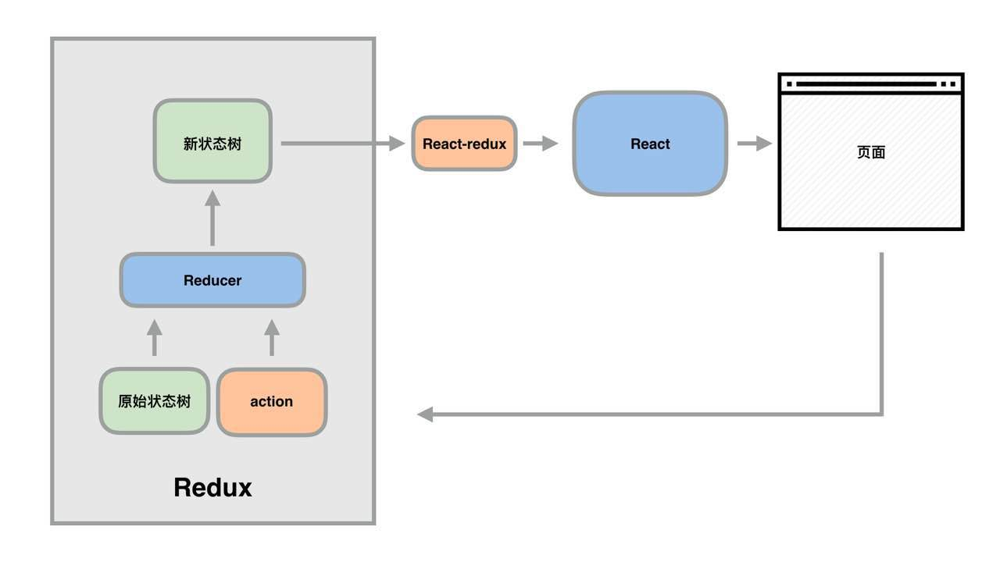

# deeper-redux
 1.React 只是 DOM 的一个抽象层，并不是 Web 应用的完整解决方案。有两个方面，它没涉及:

 - 代码结构
 - 组件之间的通信

 2.**react**在大型项目中就显得很乏力，所以2015年时候发布啦 <em>redux</em>,不一定什么时候都用上redux，阮一峰说了“如果你在考虑要不要用redux，那你就不要用啦”。什么时候用恩：多交互，多数据源的时候。

 - 某个组件的状态，需要共享
 - 某个状态需要在任何地方都可以拿到
 - 一个组件需要改变全局状态
 - 一个组件需要改变另一个组件的状态

 3.首先先知道他的运行机制  

 

 1.页面发出个事件，比如说一个点击事件，或者表单提交的事件，发出一个类似axios请求，就是store.dispatch[商店，仓库发出，派遣]
 ---
```ruby
    handleSubmit(e){
        e.preventDefault()
        const value = this.input.value
        store.dispatch({ type: 'ADD_Listnews', news: value ,index:index})
        this.form.reset()
    }
 ---
    <form onSubmit={this.handleSubmit.bind(this} ref={form => this.form=form}>
        <input type="text" ref={input => this.input=input} />
        <button>添加</button><br />
    </form>

```
